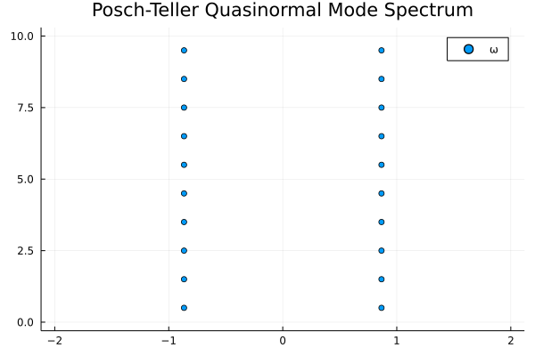

# QNMSpectralSolve.jl
This package follows what is done in https://arxiv.org/abs/2004.06434 and sets up some wave equations in hyperboloidal slicing.
It uses Spectral Chebyshev methods as outlined in the paper to cast the problem of getting Quasinormal Modes of a transformed wave equation to a problem of finding the eigenvalues of a matrix.

The eigenvalue problem is not very numerically stable, hence one needs to use `BigFloat`s and use a large of Chebyshev basis of `~200`.

```julia
using QNMSpectralSolve
using GenericLinearAlgebra
using LinearAlgebra
using Plots

## Following Eq 53. in arXiv:2004.06434
w(x) = 1
p(x) = (1-x^2)
∂ₓp(x) = -2*x
qℓ(x) = 1
γ(x) = -x
∂ₓγ(x) = -1

## Define the equation using the functions above and get the matrix
□ = WaveEquationHyperboloidal(w,p,qℓ,γ,∂ₓp,∂ₓγ; x0=-1.0,x1=1.0)
L = matrix(□,big(10)) #Get bigfloats by plugging in big(N)

## Solve the eigenvalue problem
Es = eigvals(L)
x = real.(Es)
y = imag.(Es)
scatter(x,y; xlim=[-2,2],ylim=[0,10]) |> display
```


